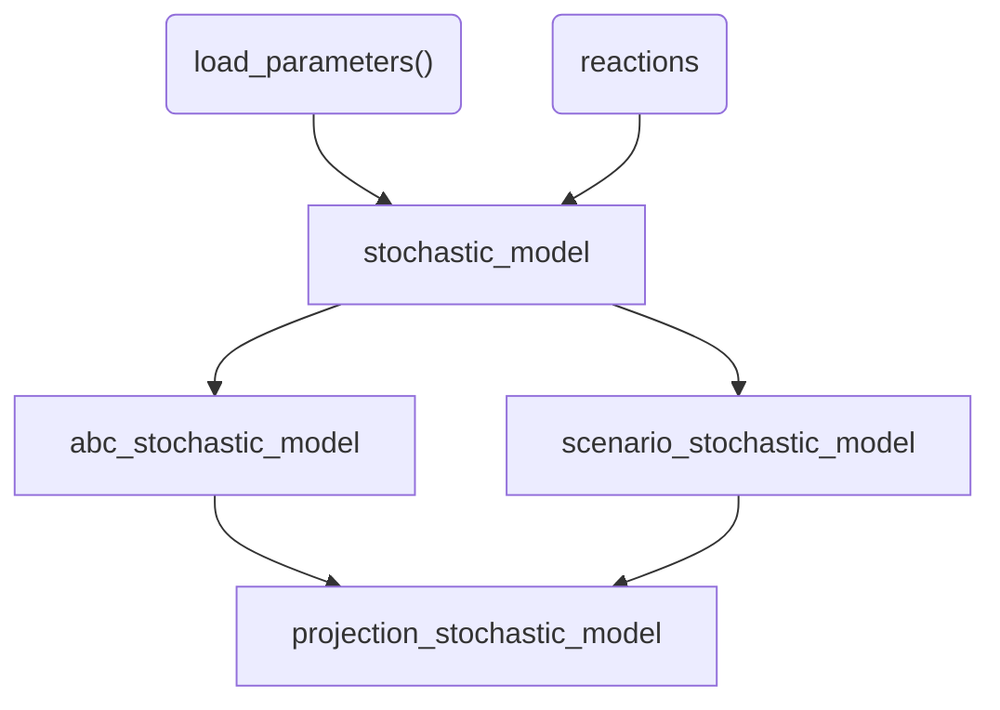

# brech

``` r
library(ggplot2)
library(dplyr)
#> 
#> Attaching package: 'dplyr'
#> The following objects are masked from 'package:stats':
#> 
#>     filter, lag
#> The following objects are masked from 'package:base':
#> 
#>     intersect, setdiff, setequal, union
library(tidyr)
library(brech)
set.seed(42)
```

## Introduction

To create a model simulation we construct an R S3 object using the
`stochastic_model` class. This expects a list of reactions including the
`transitions`: the impact on the population and `rate`: the rate at
which the event takes place. e.g. the first reaction represents an
infection event that occurs at rate $\beta SI$ where $S$ is the
population of susceptible, $I$ is the population of infected and $\beta$
is the population infectivity.

``` r
reactions <- list(
  infection = list(
    transition = c(S = -1, E = +1),
    rate = function(x, p, t) p$beta * x["S"] * x["I"]
  ),
  incubation = list(
    transition = c(E = -1, I = +1),
    rate = function(x, p, t) p$theta * x["E"]
  ),
  recovery = list(
    transition = c(I = -1, R = +1),
    rate = function(x, p, t) p$gamma * x["I"]
  ),
  case_detection = list(
    transition = c(C = +1),
    rate = function(x, p, t) p$case_rate * x["I"]
  ),
  vaccinate = list(
    transition = c(V = +1, S = -1),
    rate = function(x, p, t) 0 * x["S"]
  )
)
sim_scenario <- load_model_params() |>
  vaccinate_initial_conditions(0.8) |>
  update_parameters(beta=0.02)

sm <- stochastic_model(reactions,sim_scenario)
sm
#> Stochastic Model 
#> ================== 
#> 
#> Initial Values:
#>   S : 200  V : 799  E : 0
#>   I : 1  R : 0  C : 0
#>   D : 0
#> Parameters:
#>   r_0 : 25  latent_period : 11  infectious_period : 8
#>   ascertainment_delay : 2.5  case_delay : 3  theta : 0.0909
#>   gamma : 0.125  case_rate : 0.333  beta : 0.02
#>   N : 1000
#> Simulation arguments:
#>   T : 10
#> Reactions:
#>  - infection:
#>    Transition: [S -1, E +1]
#>  - incubation:
#>    Transition: [E -1, I +1]
#>  - recovery:
#>    Transition: [I -1, R +1]
#>  - case_detection:
#>    Transition: [C +1]
#>  - vaccinate:
#>    Transition: [V +1, S -1]
#> 
```

To run with default settings, just use the `run_sim` function


## Model fitting

Approximate Bayesian Computation (ABC) is used to perform model fitting.
This is done by defining a summary statistic and then running the
summary statistic on the data. We will use the data above as an example
and create a summary statistic for the cumulative number of cases after
10 days.

We then draw priors from a defined distribution for each parameter to be
fit. In the example below the parameter `beta` if fit to the cumulative
number of cases.

``` r
# generate summary statistics from run
# These are the number of cases on a given day
daily_cases <- sum(get_daily_cases(r)$daily_incidence)

# simulate from prior
priors <- tibble("beta" = pmax(0,rnorm(200,mean=0.1,sd=0.1)))

# statistical summary of simulation
stat_func <- function(m){
  #' get total cases 
  m |>
    get_daily_cases() |>
    dplyr::summarise(total_cases=sum(daily_incidence))
}

res <- abc_stochastic_model(sm,priors,daily_cases,stat_func)

plot(res,param = "beta")
```


We can similarly fit to daily cases. Note that we need to exclude the
first few days in the simulation where the variance in case incidence is
too low. Fitting the incidence appears to improve the model fit with
this small sample.

``` r
# simulate from prior
priors <- tibble("beta" = pmax(0,rnorm(200,mean=0.1,sd=0.1)))

# statistical summary of simulation
stat_func <- function(m){
  #' get total cases 
  m |> 
    get_daily_cases() |> 
    filter(day > 3) |> 
    pivot_wider(names_from = "day",values_from="daily_incidence", 
                names_prefix = "day_")
}

daily_cases <- stat_func(r)

res <- abc_stochastic_model(sm,priors,daily_cases,stat_func)

plot(res, param = "beta")
```


The fit also provides the final state of each simulation from the
posterior which we can compare to our fitted data

``` r
data.frame(r) |>
  filter(time == max(time)) |>
  dplyr::select(-time) |>
  mutate(type = "true value") |>
  bind_rows(
    mutate(res$state,type="posterior")
  ) |>
  pivot_longer(-type,names_to = "state", values_to = "value") |>
  ggplot(aes(x=state,y=value,color=type)) +
  geom_jitter(alpha=0.5)
```


## Scenario projection

We can then perform projections using a `abc_stochastic_model` object.
The projection will sample over the final state of the model in the
posterior as well as any associated parameters and inherit other
parameters from the underlying `stochastic_model` class. We project
forward in time using the `projection_stochastic_model` function which
also comes with default plotting behaviour.

``` r
projections <- projection_stochastic_model(res)
plot(projections, state = "I")
```


``` r
plot(projections, state = "C")
```


The `projection_stochastic_model` function can also incorporate
scenarios directly without the need for model fitting. This is useful if
there is a need to project under different scenarios where there is no
current data to inform the model fit. Under this scenario we draw from a
defined distribution of $\beta$ parameters

``` r
parameters <- tibble("beta" = runif(200,min=0.08,max=0.12))
scenarios <- scenario_stochastic_model(sm,parameters)
projections <- projection_stochastic_model(scenarios)
plot(projections, state = "I")
```


A flow chart of the dependency between defined S3 classes in the package
is provided below. The base class is `stochastic_model` which defines
the model events, rates, parameters and initial states. A `summary` of
the object can be provided and a simulation can be drawn from the model
using the function
[`run_sim()`](https://bccdc-phsa.github.io/brech/reference/stochastic_model.md).
Model fitting can be performed using the `abc_stochastic_model` or
alternatively a scenario can be generated using the
`scenario_stochastic_model` class. Finally a projection can be generated
from either a scenario or model fit using `projection_stochastic_model`.



## Age-structured model

For an age structured model we need to set-up reactions for each
age-group. This can be done explicitly as above, however would quickly
become cumbersome for a large number of age-groups. Instead we can
construct this by looping over age groups and defining each of the
reactions e.g. “infection” and “recovery”. This requires that the rates
functions are built inside a function factory to ensure that the correct
age-parameters are provided to each function. For more information see
[this chapter](https://adv-r.hadley.nz/function-factories.html).

First we construct a simple contact age contact matrix with two age
groups,

``` r
age_groups <- c("<18", "18+")
contact_matrix <- matrix(c(20,5,5,10), nrow = 2)
rownames(contact_matrix) <- age_groups
colnames(contact_matrix) <- age_groups
print(contact_matrix)
#>     <18 18+
#> <18  20   5
#> 18+   5  10
```

Next we use the `age_groups` and `contact_matrix` to populate the
`reactions` list. To illustrate the code below provides a simple
age-structured SIR model. We encapsulate this inside a function to
ensure that variables such as `age_groups` can be referenced later.

``` r
create_custom_reactions <- function(contact_matrix){
  age_groups <- colnames(contact_matrix)
  reactions <- list()
  for (i in seq_along(age_groups)){
        age_group <- age_groups[i]
        ###########################
        #  infection transitions  #
        ###########################
        transition <- function() {
          trans <- c()
          trans[paste0("S_",age_group)] <- -1
          trans[paste0("I_",age_group)] <- +1
          trans
        }
        rate <- 
          function(i,age_group){
            force(i)
            force(age_group)
            function(x, p, t) {
              I <- x[paste0("I_", age_groups)]
              S <- x[paste0("S_", age_group)] 
              lambda <- p$beta * S * sum(contact_matrix[,i] * (I / p$N))
              lambda  
            }
          }
        reactions[[paste0("infection_",age_group)]] <- list(
          "transition"=transition(),
          "rate" = rate(i,age_group)
        )
        ##############################
        #    recovery transitions    #
        ############################## 
        transition <- function() {
          trans <- c()
          trans[paste0("I_",age_group)] <- -1
          trans[paste0("R_",age_group)] <- + 1
          trans
        }
        rate <- 
        function(age_group){
          force(age_group)
          function(x, p, t) {
            I <- x[paste0("I_", age_group)]
            p$gamma * I
          }
        }
        reactions[[paste0("recovery_",age_group)]] <- list(
          "transition"=transition(),
          "rate" = rate(age_group)
        )
      
  }
  return(reactions)
}

reactions <- create_custom_reactions(contact_matrix)
```

We then apply these reactions to construct a `stochastic_model` object.
We use the function `create_age_initial_conditions` to convert the
initial conditions from a vector format to the format required for the
object.

``` r
age_scenario <- list(
  params = list(beta = 0.5, gamma = 0.2, N = 1000),
  initial_states = list(
    S = c(200, 800),
    V = c(0, 0),
    I = c(1, 0),
    R = c(0, 0)                    
    ),
  sim_args = list(T = 10)
)

age_scenario <- age_scenario |>
  create_age_initial_conditions(age_groups)


sm <- stochastic_model(reactions,age_scenario)
print(sm)
#> Stochastic Model 
#> ================== 
#> 
#> Initial Values:
#>   S_<18 : 200  S_18+ : 800  V_<18 : 0
#>   V_18+ : 0  I_<18 : 1  I_18+ : 0
#>   R_<18 : 0  R_18+ : 0
#> Parameters:
#>   beta : 0.5  gamma : 0.2  N : 1000
#> 
#> Simulation arguments:
#>   T : 10
#> Reactions:
#>  - infection_<18:
#>    Transition: [S_<18 -1, I_<18 +1]
#>  - recovery_<18:
#>    Transition: [I_<18 -1, R_<18 +1]
#>  - infection_18+:
#>    Transition: [S_18+ -1, I_18+ +1]
#>  - recovery_18+:
#>    Transition: [I_18+ -1, R_18+ +1]
#> 
```

As before we can run this simulation and plot

``` r
r <- sm |>
    run_sim() |>
    as.data.frame() |>
    tidyr::pivot_longer(
      cols = tidyselect::starts_with("I_"),
      names_to = "age_group",
      names_prefix = "I_",
      values_to = "I"
    )
r |> ggplot(aes(x=time,y=I, color= age_group)) + geom_line()
```


We can also vaccinate the initial population by age group. In the
example below we imagine that the \<18 age group is 10% vaccinated and
the 18+ age group is 90% vaccinated. Notice that the initial values are
now updated.

``` r

sm |> vaccinate_initial_conditions(c("<18"=0.1,"18+"=0.9))
#> Stochastic Model 
#> ================== 
#> 
#> Initial Values:
#>   S_<18 : 180  S_18+ : 80  V_<18 : 20
#>   V_18+ : 720  I_<18 : 1  I_18+ : 0
#>   R_<18 : 0  R_18+ : 0
#> Parameters:
#>   beta : 0.5  gamma : 0.2  N : 1000
#> 
#> Simulation arguments:
#>   T : 10
#> Reactions:
#>  - infection_<18:
#>    Transition: [S_<18 -1, I_<18 +1]
#>  - recovery_<18:
#>    Transition: [I_<18 -1, R_<18 +1]
#>  - infection_18+:
#>    Transition: [S_18+ -1, I_18+ +1]
#>  - recovery_18+:
#>    Transition: [I_18+ -1, R_18+ +1]
#> 
```

We can similarly generate projections using the
`scenario_stochastic_model` object,

``` r

parameters <- tibble("beta" = runif(200,min=0.08,max=0.12))
scenarios <- scenario_stochastic_model(sm,parameters)
projections <- projection_stochastic_model(scenarios)
plot(projections, state = "I")
```


A series of helper functions can also be used to construct quantiles and
plot summaries from an age-structured model as long as the states are
named in the format `{model_state}_{age_group}`.

``` r
projections |> 
  projection_quantiles_by_age_group("I") |>
  plot_projections_by_age_group("I")
```


The final state can also be extracted by first making the projections
longer and then examining the recovered individuals at the max time,

``` r
projections$projection |>
  create_age_group_column("R") |>
  filter(time == max(time)) |>
  ggplot(aes(fill=age_group,x=R)) +
  geom_density(alpha=0.2) +
  labs(x = "Final size",fill="")
```


## Fitting initial conditions

`abc_stochastic_model` can also take in initial states in its fitting
using the optional `states` argument. This needs to be a complete model
state for each row e.g.,

``` r
N <- c(200,800)
vaccine_rate <- c(0.1, 0.5)
infection_rate <- c(0.02,0.01)
nsamples <- 100
V <- matrix(rbinom(2*nsamples, size = rep(N, times = nsamples), 
              prob = rep(vaccine_rate, times = nsamples)),
       nrow = nsamples, byrow = TRUE)
S <- matrix(rep(N,times=nsamples), nrow=nsamples,byrow = TRUE) - V
# simulation initial infections 
I <- matrix(rbinom(2*nsamples, size = rep(N, times = nsamples), 
              prob = rep(infection_rate, times = nsamples)),
       nrow = nsamples, byrow = TRUE)
zero_state <- matrix(rep(0,times=2*nsamples), nrow=nsamples)
states <- as.data.frame(cbind(S, V, I, zero_state))
colnames(states) <- c("S_<18", "S_18+", "V_<18", "V_18+", 
                      "I_<18", "I_18+", "R_<18", "R_18+")
head(states)
#>   S_<18 S_18+ V_<18 V_18+ I_<18 I_18+ R_<18 R_18+
#> 1   188   412    12   388    12    10     0     0
#> 2   178   401    22   399     4     8     0     0
#> 3   183   384    17   416     3     8     0     0
#> 4   183   384    17   416     4     5     0     0
#> 5   184   376    16   424     5     2     0     0
#> 6   175   414    25   386     5     3     0     0
```

We can also project from a set of states with associated parameters

``` r
# fix beta parameter
sm <- sm |> update_parameters(beta = 0.1)

# define scenario based on list of states
example_scenario <- scenario_stochastic_model(sm, states = states)
state_projections <- projection_stochastic_model(example_scenario)
plot(state_projections, state = "I")
```


We can perform model fitting as before using the `states` as a prior in
the model that it is sampled from. In the example below we generate some
data with an initial distribution of vaccinated among children and
adults and use the number of recovered in each age group as the summary
function.

``` r
age_scenario <- list(
  params = list(beta = 0.1, gamma = 0.2, N = 1000),
  initial_states = list(
    S = c(190, 400),
    V = c(10, 400),
    I = c(1, 0),
    R = c(0, 0)                    
    ),
  sim_args = list(T = 10)
)

age_scenario <- age_scenario |>
  create_age_initial_conditions(age_groups)


sm <- stochastic_model(reactions,age_scenario)

r <- run_sim(sm) |> as.data.frame()

stat_func <- function(m){
  #' get total cases by age group
  m[nrow(m),startsWith(colnames(m),"R")]
}

cumulative_cases <- stat_func(r)
```

``` r
# simulate from prior
priors <- tibble("beta" = pmax(0,rnorm(100,mean=0.1,sd=0.1)))


res <- abc_stochastic_model(sm,priors,cumulative_cases,stat_func,
                            states = states)

plot(res, param = "beta")
```


## Using `multisession` and `progressr`

Both `abc_stochastic_model` and `projection_stochastic_model` can be
parallelized using the `future` package together with
[`progressr`](https://progressr.futureverse.org/) to generate a progress
bar. For more complex and realistic models these will be essential to
speed up computation and monitor progress. An example of its use with
two workers is provided below,

``` r
# set up multisession environment
plan(multisession, workers = 2)

# run projections in parallel
progressr::with_progress({
  state_projections <- projection_stochastic_model(example_scenario)
})
```
